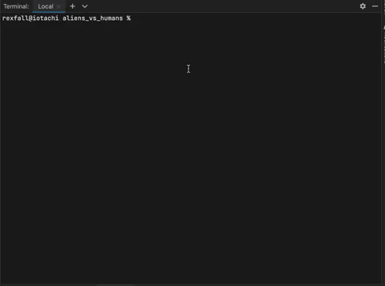

# README

## Project Title
Aliens vs. Humans

---
## Description
I created this project for my portfolio as part of the Codecademy Intermediate Java course. The assignment title is "Aliens vs. Humans," and the propmpt is as follows:

> Welcome to the project for JUnit Testing. In this project, you will create a Java project on your own computer that contains all of the elements that we’ve covered in this course.
>
>Project Objectives:
>Here is a summary of the project objectives. More details about each objective can be found in the Kanban board for this project:
>
>- Consider which traits between your entities will be inherited and which will be unique per entity
>- Come up with unique traits and abilities for your Human entity
>- Come up with unique traits and abilities for your Alien entity
>- Create classes for your entities and an environment for interaction
>- Implement your unique ideas and write JUnit Tests as code is added

I based this project on a laser tag arena where I used to work. I developed this project with a red-green-refactor TDD approach, writing the test classes first, then the underlying code.
 

---
## Features
This project includes 13 files:
* This README document
* BeingTestSuite.java, which contains the JUnit test suite
* TestSuiteRunner.java, which runs the Being test suite
* TestPower.java, which contains test methods for the Power class
* TestBeing.java, which contains test methods for the Being class
* TestAlien.java, which contains test methods for the Alien class
* TestHuman.java, which contains test methods for the Human class
* TestArena.java, which contains test methods for the Arena class
* Power.java, which provides a framework for special powers the alien character might have
* Being.java, which is the superclass for aliens and humans and provides shared traits (variables) and skills (methods)
* Alien.java, which extends the Being class and defines the alien character
* Human.java, which extends the Being class and defines the human character
* Arena.java, which defines the setting for the battle simulation and includes the main method to run the program

---
## Synopsis of the Simulation
When this program is run, the simulation progresses in the following sequence:
1. An arena is created using predetermined parameters.
2. A human character is spawned at a random location within the arena, and the character's details are printed.
    - The character's traits (Intelligence, Perception, Brawn, and Agility) are assigned at random.
    - The character's equipment is assigned at random.
3. An alien character is spawned at a random location within the arena, and the character's details are printed.
    - The character's traits are assigned at random.
    - The character's equipment and/or special power are assigned at random.
4. The battle begins. Each round starts with an initiative roll to determine who goes first.
5. Each character takes a certain number of turns per round. On each turn, the character's action is selected by a set of predetermined criteria. The character might use a special power, hide to prepare an ambush, attack, or move.
6. The battle ends when one of the characters runs out of Vitality (dies) or the characters reach a stalemate where neither can damage the other.

---
## How to Use
1. Compile the classes using the javac terminal command.
2. Run the resulting Arena.class file in a command line.

---
## Technologies
* Java

---
## Collaborators
None (this was a solo endeavor).

---
## License
[Open Data Commons Open Database License v1.0](https://choosealicense.com/licenses/odbl-1.0/)